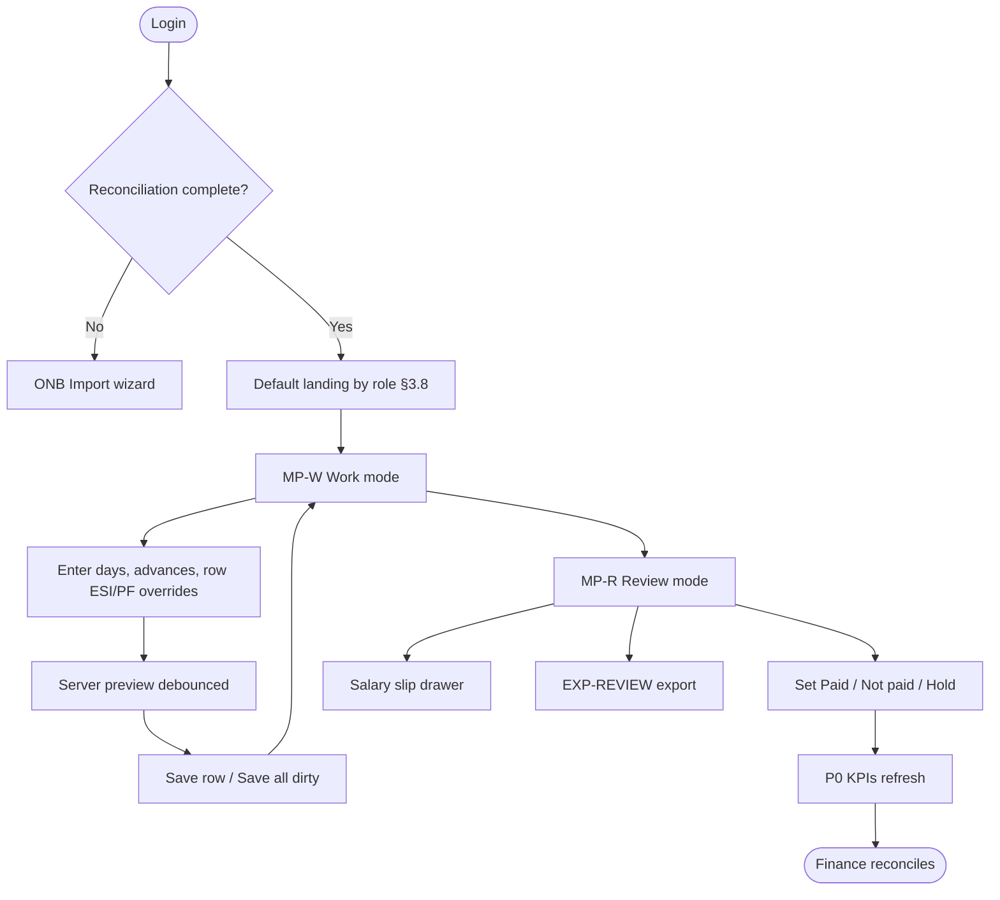
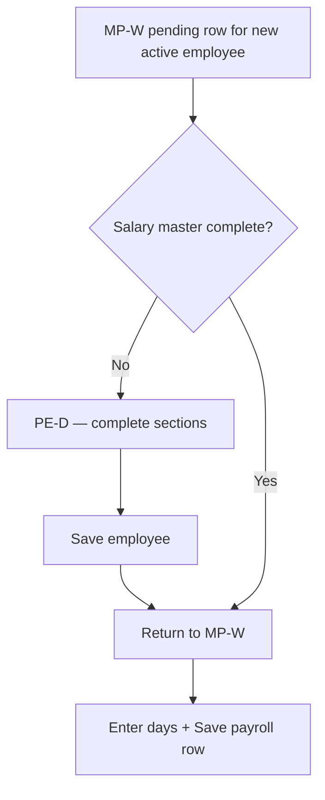
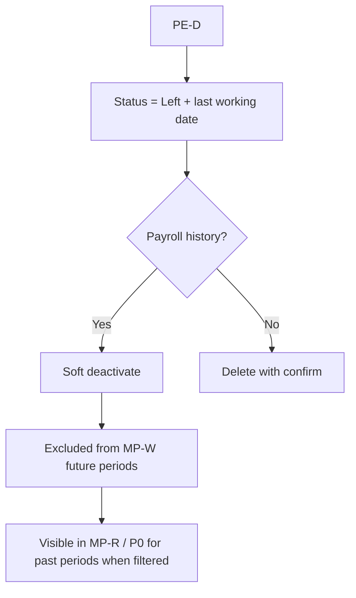
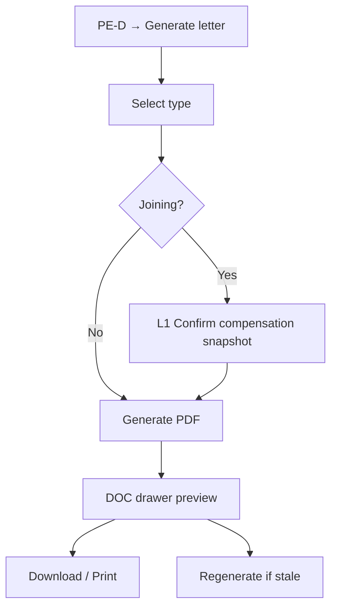
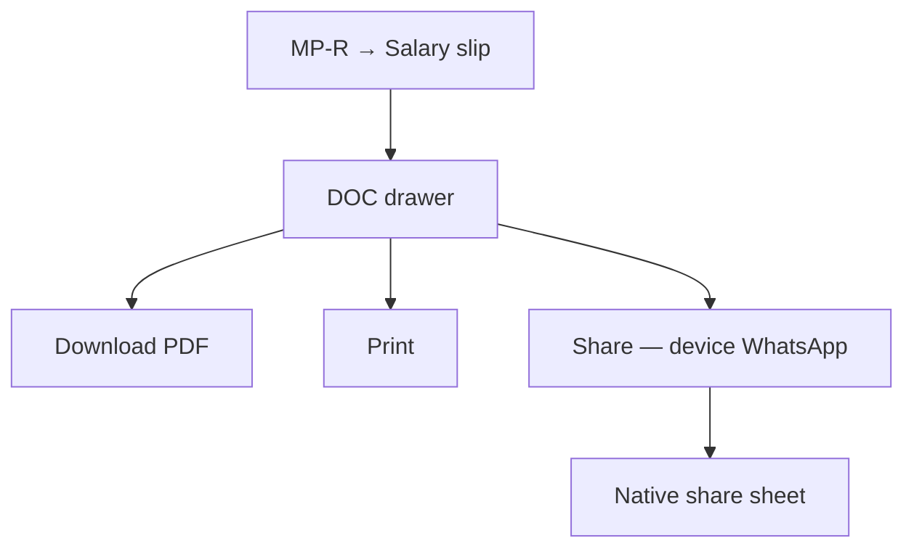
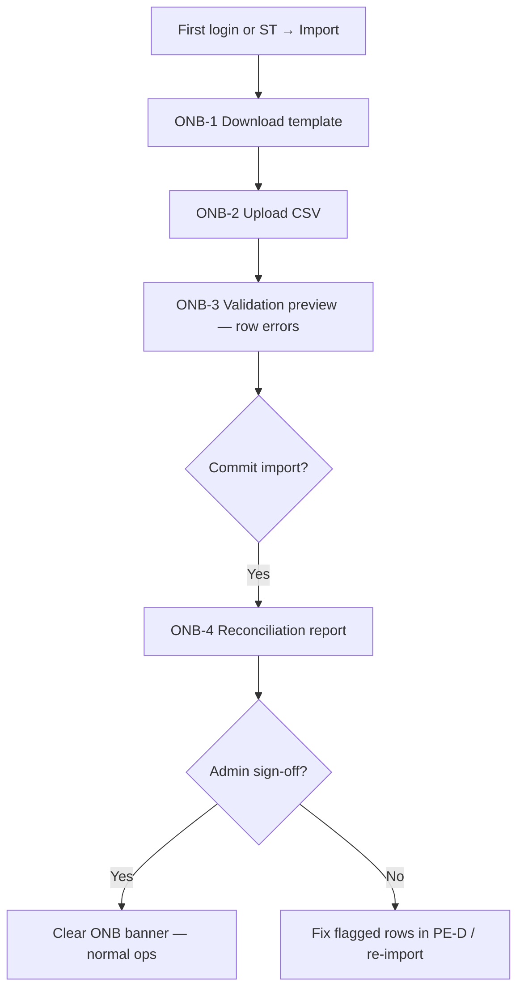
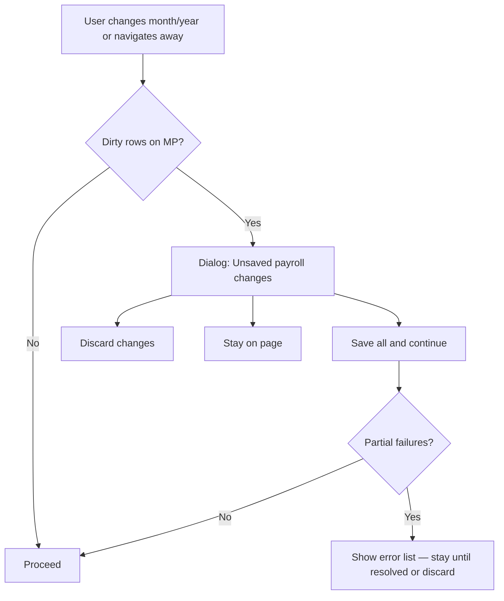

# Birbal Group — Payroll & HR Operations  
## Mira design specification (IA, flows, components)

**Version:** 1.5  
**Date:** 2026-08-18  
**Owners:** Mira (Product Design), Lux (visual direction), Voss (strategic alignment), Ada (domain rules)  
**Source requirements:** `Context/Birbal_Group_Payroll_Requirements.md`  
**Visual pass:** `design/birbal-payroll-lux-visual-pass.md`  
**UI foundation:** `design/birbal-ui-foundation.md` · engineering app `birbal-payroll/`  
**Status:** Lux visual pass implemented in prototype v3+ and React shell; P0 blocked-state hierarchy live  
**Scope:** Internal ops web app — multi-brand restaurant payroll & HR documents. Not lead-gen, not employee self-service, not ERP.

**Changelog (1.4 → 1.5):** PE-D employee recognition — **initials avatars v1** (Directory + detail header); **photos optional phase 2** with consent; Register and MP tables remain avatar-free for density; DR-AVATAR rules added.

**Changelog (1.3 → 1.4):** Lux visual implementation — Birbal Ops tokens applied (canvas `#F5F6F8`, teal accent); P0 next-action hero with state variants (`blocked` / `ready` / `locked`); payroll exceptions muted when import pending; lifecycle rail done steps show check marks; elevated table cards + sticky headers; operator nav label **Month close** (RFP alias: Dashboard); period controls P0-only (confirmed); Geist-only display type (no serif).

**Changelog (1.2 → 1.3):** Four-item operator nav with RFP route aliases; P0 rewritten (lifecycle, blockers vs exceptions, reconciliation checklist); lifecycle stage gating; exception taxonomy; payment audit readout; save-all progress + period lock confirm; shadcn/Geist typography for React implementation; preview surface styling enforced.

**Changelog (1.1 → 1.2):** Lux visual pass merged — Birbal Ops tokens (§9), Lux acceptance IDs on screens, hi-fi frame priority.

**Changelog (1.0 → 1.1):** Single nav strategy; ESI/PF domain rules; dirty-state flows; CSV schemas; scale UX; migration wizard; edit-lock rules; preview API; explicit out-of-scope; expanded open deps.

---

## 0. Voss — strategic alignment (non-negotiable)

### 0.1 Envelope test

| Question | Answer |
| --- | --- |
| Plain-language business need? | Yes — “run monthly payroll without spreadsheets” |
| Maps to KaushalStack layer? | **Operations** — bounded payroll/HR ops |
| Composable from skills catalog? | Yes — **Operate / Payroll** skill pattern, reusable for restaurant groups |
| Shared infra economics? | Yes — tenant + period + calculation service + document pipeline |
| Strengthens trust or network? | **Trust first**; lighthouse case study is a *commercial* upside, not a v1 design requirement |

**Voss verdict:** Build as a **composed bounded ops system**, not a one-off CRUD app. IA must survive 10 brands, 50 locations, and 1,000 employees without a nav rewrite.

### 0.2 What “no bandaids” means here

A **bandaid** is a UX or IA shortcut that papers over a structural problem and creates debt:

| Bandaids (reject) | Structural fix (adopt) |
| --- | --- |
| Separate **Payroll Entry** and **Payroll Summary** pages with duplicate tables | **One Monthly Payroll workspace** with Work / Review modes |
| **Master Employee** as orphan third employee list | **People** module with Directory + Register **views** on same data |
| Dashboard full grid duplicating Review at scale | **Period Home** = KPIs + location subtotals + “needs attention” list; full grid in MP-R only |
| Client-side gross/net that “usually matches” server | **`POST /api/payroll/preview`** + server save; UI labels preview vs saved |
| Export buttons with undocumented column drift | **EXP-01** canonical CSV schemas (§3.9) |
| Visible dual nav (modern + RFP labels) | **One sidebar** — RFP labels for Birbal familiarity (§3.4) |
| ESI/PF editable in register and payroll with no precedence | **DR-ESI/PF** domain rules (§3.6) |
| HR letters buried in row menu only | **Document drawer** from employee + payroll context |
| Settings mixed with letterheads in one scroll | **Settings** grouped: Organization · Documents · Access · Activity (phased) |
| Auth/RBAC bolted on after launch | **Shell designed for roles** from day 1 (masking, disabled actions) |
| Emoji status, color-only paid/pending | **Text + icon + color** status chips; WCAG AA |
| Modal stack for 5-section employee form | **Full-page employee record** with anchored sections |

**Trust is the product.** Payroll operators must never wonder which screen has the “real” number.

### 0.3 Sequencing note

Design assumes **login required in v1** with **role-ready UI** (disabled/hidden by permission). Phase 1 single admin is a **policy** choice, not an excuse for an unsecured shell.

### 0.4 Deployment model (composability)

| Model | Birbal engagement | Reuse |
| --- | --- | --- |
| **A — Standalone tenant** (default for Birbal) | Dedicated app, Birbal branding, own DB | Calculation + document pipeline extracted as KaushalStack **Operate / Payroll** skill |
| **B — KaushalStack module** (future) | Same IA inside Owner Portal → Operations | Tenant theme tokens swap logo/colors; routes unchanged |

**Composable elements (not throwaway):** period spine, payroll table component, document drawer, lookup manager, import wizard, statutory rule version display. **Birbal-specific:** letter conduct text, letterhead assets, default period rule.

### 0.5 Explicit v1 out of scope (design)

Document in proposal; do not leave silent gaps:

| Item | RFP reference | v1 handling |
| --- | --- | --- |
| Warning letters | Optional §3.3 | **Out of scope** unless Birbal confirms Q1 |
| Employer ESI/PF cost report | Ada §13 Q13 | **Out of scope** — employee deductions only in UI; employer rates in rule panel read-only footnote |
| Audit log / Activity feed | Optional | **Phase 2** — Settings → Activity; v1 design reserves nav slot, hidden |
| Payroll period lock | Q9 | **Configurable** — see edit-lock rules §6.1 |
| WhatsApp Business API | Optional | Browser/device share only |
| Bulk slip generation | — | Single-row slip v1; batch optional phase |
| Employee self-service | Out of scope | — |

---

## 1. Problem statement

Birbal runs payroll across **4 brands, 8 locations, ~41 employees** today (scaling to 10 / 50 / 1,000). The legacy app and spreadsheets produce:

- Inconsistent salary math between screens and PDFs  
- Duplicate payroll rows  
- Split workflows (enter in one place, mark paid in another)  
- PII exposure risk without clear role boundaries  

**Primary user job:** Complete **one payroll period** — enter days and deductions, verify totals, mark payment status, export for finance, issue slips — with **one authoritative calculation** everywhere.

**Secondary jobs:** Maintain employee master, generate HR letters, configure brands/locations/letterheads, **migrate and reconcile** legacy data at cutover.

---

## 2. Design principles

| # | Principle | Implication |
| --- | --- | --- |
| D1 | **Period-first** | Month + year are global context on P0 and MP; brand/location are filters |
| D2 | **One table, two modes** | Work and Review share one component; mode changes editability and actions |
| D3 | **Editable ≠ calculated** | Visual system distinguishes inputs from server-computed amounts |
| D4 | **Drill, don’t duplicate** | P0 KPIs and subtotals link to MP-R; avoid second full grid on P0 at scale |
| D5 | **Save state is explicit** | Draft / saved / paid / hold always visible; no silent autosave |
| D6 | **Documents from context** | Slips from payroll row; letters from employee record; one drawer pattern |
| D7 | **Ops density, not consumer sparkle** | Dense tables, sticky headers, keyboard-friendly |
| D8 | **One nav, operator labels + RFP routes** | Sidebar shows **4 operator destinations**; URLs alias to RFP paths (§3.3) |
| D9 | **Role-aware by default** | Mask PAN/Aadhaar/bank; gate actions before RBAC ships |
| D10 | **No fake intelligence** | Show statutory rule version on breakdown, not “AI calculated” |
| D11 | **Preview is server-backed** | Unsaved rows call preview API; never ship client-only payroll math |
| D12 | **Cutover is a first-class journey** | Import wizard gates normal ops until reconciliation signed off |

---

## 3. Information architecture

### 3.1 Conceptual model (spine)

```
Organization
  └── Brand
        └── Location
              └── Employee (master)
                    ├── statutory_defaults (ESI/PF applicable)
                    └── PayrollPeriodRow (employee × month × year)
                          ├── row overrides (ESI/PF toggles, days, deductions)
                          ├── payment_status
                          └── Documents (salary slip)
                    └── HR Documents (joining / experience / termination)
```

**Primary navigation object:** `PayrollPeriod` = `{ month, year }`  
**Secondary filters:** brand, location, payment status, employee status (active/left)

### 3.2 Application IA (target)

```
Birbal Payroll & HR
├── [ONB] Import & reconciliation wizard   (first-run / cutover — not permanent nav)
├── Month close                    [P0]  ← RFP: Dashboard
├── People                         [PE]  ← RFP: Employees + Master Employee (views)
│   ├── Directory view
│   └── Register view
├── Monthly Payroll                [MP]  ← RFP: Payroll Entry + Payroll Summary (modes)
│   ├── Work mode
│   └── Review mode
└── Settings                       [ST]
    ├── Organization
    ├── Letterheads
    ├── Access                     (users/roles — when in scope)
    └── Activity                   (audit log — phase 2, nav hidden until enabled)
```

**Out of shell nav (flows, not modules):**

- Salary slip / HR letter — document drawer [DOC]  
- Import wizard — [ONB] triggered at first login or ST → Import  

### 3.3 Navigation — operator IA + RFP route compatibility

**Operator sidebar (4 destinations):** Month close · People · Monthly Payroll · Settings.

**RFP route aliases:**

| RFP label | Alias route | Lands on |
| --- | --- | --- |
| Dashboard | `/dashboard` | Month close [P0] |
| Employees | `/people` | People · Directory [PE-D] |
| Master Employee | `/people/register` | People · Register [PE-R] |
| Payroll Entry | `/payroll?mode=work` | MP · Work [MP-W] |
| Payroll Summary | `/payroll?mode=review` | MP · Review [MP-R] |
| Settings | `/settings` | Settings [ST] |

One payroll table. No duplicate nav footer.

### 3.4 Global shell

**Desktop (≥1024px):** Sidebar 240px; period bar on P0 + MP.

**Typography (shadcn):** Geist Variable for all UI text including page titles (`--font-sans`); Geist Mono for codes and account refs (`--font-mono`). No secondary display serif — hierarchy via weight and size only.

**Mobile:** Bottom nav; sticky period strip; payroll cards (§7.5).

### 3.11 Period lifecycle gating

Open → Working → Reconciled → Paid → Locked. Import blocks Working. Lock requires confirm dialog + checklist.

### 3.12 Exception taxonomy

Import blockers (blocker/warning/info) separate from payroll exceptions (max 4 + view all on P0).

### 3.5 Period context controls (P0 only)

**Placement:** Month/year/brand/location selectors live on **Period home (P0)** — not in the global app header. Monthly Payroll shows **read-only** period context with a link back to P0 to change period.

| Control | Behavior |
| --- | --- |
| Month / Year | Required; **blocked if dirty rows** unless user confirms (§5.8) |
| Brand | Optional; cascades location |
| Location | Optional |
| Reset filters | Clears brand/location only |

**MP read-only strip:** `{period} · {brand filter} · {location filter}` + “Change period →” → P0.

**Default period:** TBD with Birbal (RFP: January → previous month). Wireframe assumption: previous calendar month.

### 3.6 Domain rules — ESI/PF precedence (Ada)

**DR-ESI-01** Each employee has **statutory defaults**: `esi_applicable`, `pf_applicable` (master record; editable in PE-D Statutory section and PE-R inline toggles — **same field**).

**DR-ESI-02** Each payroll row may **override** defaults for that month via row toggles in MP-W. Override persists on payroll record only; does not change employee master unless operator edits PE-D/PE-R.

**DR-ESI-03** **Display precedence** on MP / P0 / slip:

1. If payroll row saved → use row override values  
2. Else if row unsaved → use employee defaults for preview  
3. Preview amounts from **`POST /api/payroll/preview`**

**DR-ESI-04** Changing master default in PE-R/PE-D does **not** retro-edit saved payroll rows for past months. Optional banner on MP-W: “N saved rows still use prior defaults” if master changed mid-period (informational only).

**DR-ESI-05** PE-R inline toggle saves to **employee master** immediately (FR-MST-04). MP-W row toggle saves to **payroll row** on row save.

### 3.7 Scale & performance UX

Targets from requirements: 1,000 employees, 50 locations, 10-year history.

| Concern | Design requirement |
| --- | --- |
| Payroll table | **Virtualized scroll** or paginated (50 rows/page) with persistent search; sticky header + first column |
| Save all | Progress modal: “Saving 38 rows…” with per-row error list; partial success allowed |
| P0 at scale | **No full employee grid by default** — see P0 §6 |
| PDF slips | Single-row v1; batch generation shows queue modal (optional phase) |
| History | Year selector bounded per Q17; archive periods read-only |
| Search | Required on MP toolbar when active employees > 25 |

### 3.8 Default landing by role

| Role | Default route after login |
| --- | --- |
| Payroll operator | `/payroll?mode=work` (current period) |
| Finance / read-only | `/` Period Home |
| HR admin | `/people` |
| System admin (cutover) | `/onboarding/import` if reconciliation incomplete |

v1 single admin: default **`/payroll?mode=work`** during month-close window; **`/`** otherwise (configurable later).

### 3.9 CSV export schemas (EXP-01)

Two exports, **fixed column order**, documented in API spec:

**EXP-DASH** — from P0 “Export CSV” (dashboard context):

`period_month, period_year, location, brand, employee_code, employee_name, row_state, days_worked, gross, net, payment_status, esi_employee, pf_employee, esi_applicable, pf_applicable`

**EXP-REVIEW** — from MP-R toolbar (payroll review context):

All EXP-DASH columns plus: `outlet_advance, company_advance, other_deduction, per_day_effective, notes, bank_name, bank_account_masked, ifsc`

Both exports respect active filters. Totals row optional footer row (documented). **Anti-pattern:** ad hoc columns per page.

### 3.10 Preview API (API-PREV — Atlas handoff)

| Endpoint | Purpose |
| --- | --- |
| `POST /api/payroll/preview` | Accept same body as upsert minus persist; return calculated gross, ESI, PF, net + rule_version_id |
| `POST /api/payroll/upsert` | Persist row; return saved amounts |

UI calls preview on debounced field change (300ms) and before save. **Never** display client-computed gross/net as final. §12 anti-pattern enforced in code review.

---

## 4. Personas & jobs-to-be-done

| Persona | Primary surface | Success in one session |
| --- | --- | --- |
| **Payroll operator** | MP-W → MP-R | All active employees saved; statuses set; CSV exported |
| **HR admin** | PE-D | New hire complete; joining letter PDF generated |
| **Finance / management** | P0 | Reconciled totals match bank outflow plan |
| **System admin** | ONB + ST | Import reconciled; location added; letterhead uploaded |

---

## 5. User flows

### 5.1 Monthly payroll cycle (primary)



**Interaction budget:** Login → first row saved in **≤4 actions** when default landing is MP-W.

### 5.2 New employee mid-cycle



### 5.3 Employee leaving



**Historical access:** MP-R and P0 include **left** employees when viewing **past periods** in which they have saved rows. Filter: `Include left employees` (default on for past months, off for current month Work mode).

### 5.4 HR letter generation



**L1 Confirm screen (joining only):** Read-only summary — name, role, basic+HRA+other+bonus, effective per-day, joining date, probation text. Checkbox: “Information is correct.” Then Generate.

**Conduct rules:** Static template; multi-page PDF with explicit page breaks (Q16). Warning letter **not in v1** unless Q1 confirmed.

### 5.5 Salary slip distribution



Distribution model TBD (Q12): v1 assumes **operator-initiated** per row, not bulk email.

### 5.6 Settings — lookup & letterhead

Unchanged from v1.0 — CRUD with usage guard; letterhead preview on slip mock.

### 5.7 Import & reconciliation (ONB — cutover)

**Not buried in Settings.** First-class wizard:



**P0 banner** until sign-off: “Migration reconciliation pending — {n} issues remaining.” Links to ONB-4 report.

### 5.8 Dirty rows — period change or navigation



Same pattern for browser `beforeunload` when dirty.

### 5.9 Session expiry mid-edit

Banner: “Session expiring in 5 minutes — save payroll changes.” On expiry: redirect to login; unsaved draft **not** persisted server-side v1 (localStorage optional recovery — document as best-effort only).

---

## 6. Screen specifications

### 6.1 Edit-lock rules (Work / Review / Paid / Period lock)

| State | MP-W editable fields | MP-R editable fields |
| --- | --- | --- |
| Unsaved draft row | Days, advances, deductions, row ESI/PF, notes | Payment status only after first save |
| Saved, not paid | Same as draft | Payment status, slip actions |
| Saved, **Hold** | Days, advances, deductions (with confirm) | Payment status, slip |
| Saved, **Paid** | **Locked** — view + expand breakdown only | Payment status change requires confirm dialog |
| Period locked (Q9) | All fields read-only | Payment status read-only |
| Review mode | **No** days/advance inputs visible (hidden or disabled) | Payment status, slip |

**Principle:** Review mode cannot silently become Entry. Toggle to Work for edits.

---

### P0 — Month close (Dashboard)

**Purpose:** Answer "What must I do to close this period?" — not a second payroll grid.

**Layout:** Period title + caption (“Month close overview”) + lifecycle rail · state chip · **primary next-action hero** (elevated card, left accent — error when blocked, teal when in progress, green when ready, muted when locked) · import blockers (if pending) · payroll exceptions (**muted + non-interactive** when import pending; max 4 + view all when unblocked) · location rollup · **period totals card (always visible)** · reconciliation checklist + export + lock confirm.

**Visual hierarchy (Lux):** When import blocks sign-off, next action = **Review import →**; exceptions section de-emphasized with helper note until sign-off completes.

**Location rollup (By location):**

| Element | Spec |
| --- | --- |
| **Purpose** | Subtotals per location; drill to MP-R with location filter applied — not a second payroll grid |
| **Section title** | “By location” + helper line: “Select a row to open Payroll Summary filtered to that location.” |
| **Layout** | Column header row (Location · Emp · Net total · Status · →) + data rows in CSS grid — **not** flex space-between |
| **Row anatomy** | Line 1: location name (semibold). Line 2: brand (tertiary caption). Right columns: emp count, net (tabular 15px semibold), status chip, chevron |
| **Sort** | Default net descending (largest outflow first) |
| **Status chip** | “N open” (pending/unsaved in location) or “Clear” (all paid + saved) — icon + label |
| **Affordance** | Chevron-right always visible; row hover mutes bg + chevron shifts accent; focus ring on keyboard |
| **Scale** | ≤50 locations: flat table. >50 or multi-brand emphasis: optional group-by-brand accordion (phase 2) |

**Lock period:** Confirm dialog; disabled until checklist complete.

**Acceptance:** Totals match MP-R; EXP-DASH per §3.9. Lux: L-P0-1..4.
---

### PE-D — People · Directory

**List toolbar:** Search + **Add employee** (Directory view only; hidden on Register).

**Employee recognition (Mira v1.5):**

| Question | Decision |
| --- | --- |
| Photos in Directory? | **No for v1** — ops identify staff by name + brand + location at payroll desk; FR-SLP/FR-EMP do not require photos |
| v1 substitute | **Initials avatar** — 32px circle beside name; deterministic color from `employee_id`; left employees at 50% opacity |
| Photos later? | **Phase 2 optional** — upload on PE-D Personal; show when `photo_url` set; fallback to initials; consent checkbox required |
| Where avatars appear | **PE-D Directory** + **PE-D detail header** (40px) only |
| Where avatars do **not** appear | **PE-R Register**, **MP-W/R** (density), **salary slip** (FR-SLP-01 has no photo field) |

**DR-AVATAR-01** Initials = first letter of first name + first letter of last name (e.g. Rahul Sharma → RS). Single-name fallback: first two letters.

**DR-AVATAR-02** Avatar colors from fixed palette (`accent`, blue, amber, violet, green) via `employee_id % palette.length` — white label text; WCAG AA contrast on circle.

**DR-AVATAR-03** Phase 2 photo: max 500 KB JPG/PNG; store outside web root; strip EXIF on upload; delete on mark-left after retention policy (confirm with Birbal).

**Name column anatomy (Directory):**

```
[RS]  Rahul Sharma
      EMP-001
```

Avatar + stacked name/code replaces scanning separate Code + Name columns at small scale; **Code column may remain** for sort/export until Birbal confirms merge.

Full-page employee record (5 sections); statutory edits here update **master defaults** (DR-ESI-01).

Salary section: effective per-day via **preview API** on debounced change.

Footer: Save · Cancel · Generate letter · Mark left

---

### PE-R — People · Register

View toggle: `Directory | Register`

Inline ESI/PF toggles → save to **employee master** (DR-ESI-05). Toast on save.

**Print:** Disabled while row has unsaved toggle; prints **last saved** snapshot only.

Register-specific columns per FR-MST-02; statutory footnote links to read-only rule panel (includes employer rates for reference — not in totals).

---

### MP-W — Monthly Payroll · Work mode

Toolbar: Search · Save all (N dirty) · `{saved}/{total} saved` · progress on batch save

**Row expand (required v1):** Calculation breakdown — inputs, formula steps, rule_version_id, preview vs saved indicator.

Preview via API-PREV; label “Preview” until save returns server amounts.

**Lux acceptance:** L-MP-1..5 (see visual pass).

---

### MP-R — Monthly Payroll · Review mode

Per §6.1. Toolbar: EXP-REVIEW export · bulk mark paid (optional — confirm with Birbal).

**Include left employees** filter for historical periods.

---

### DOC — Document drawer

States: loading preview · ready · **generation failed** (retry) · **stale** (employee/row changed — regenerate CTA)

Joining letter: multi-page; conduct rules page-break template per Q16.

---

### ST — Settings

Organization · Letterheads · Access (field visibility matrix when Q7 answered) · Activity (phase 2 — hidden)

**Organization tab (FR-SET-01):** CRUD cards for **Brands**, **Locations** (grouped by brand), **Departments**, **Designations**, **Employment types**. Each card: list with usage count, **+ Add** action, delete guarded when in use (FR-SET-02). Prototype may show read-only lists with usage badges.

---

### ONB — Import wizard

Full-screen stepped flow ONB-1..4. Reconciliation report: counts, duplicates, missing fields, salary delta, manual review queue. Sign-off checkbox + admin name + date.

---

## 7. Core component — Payroll period table

### 7.1 Anatomy

Sticky first column (employee); horizontal scroll with fade hint. Expand row → breakdown panel (required).

### 7.2 Field styling (D3)

| Type | Visual |
| --- | --- |
| Editable | Bordered input, focus ring |
| Server calculated (saved) | Muted fill |
| Preview (API-PREV) | Muted fill + **dashed border** + “Preview” caption |
| Locked (paid / period lock) | Muted + lock icon |
| Error | Red border + inline message |

### 7.3 Row actions by mode

| Mode | Actions |
| --- | --- |
| Work | Save row · Expand breakdown |
| Review | Payment status · Slip · Expand breakdown |

### 7.4 States

Default · hover · focus · saving · error · disabled · locked · empty

### 7.5 Responsive — mobile card layout

**Breakpoint:** <768px — no horizontal table.

Each employee = **card**:

- Header: name, code, brand/location, status chip  
- Body: editable fields stacked (days → advances → deductions → toggles)  
- Footer: calculated amounts + **Save** (44px min height)  
- Expand: breakdown accordion inside card  

Search filters card list. Virtualization applies to card list at scale.

---

## 8. Component library (minimum set)

| Component | Variants / states |
| --- | --- |
| **Period context bar** | default, loading, disabled, **dirty-blocked** |
| **KPI metric card** | default, clickable, loading, zero |
| **Status chip** | processed, pending, paid, not paid, hold, active, left, error |
| **Payroll table / card** | work, review; locked; §7 states |
| **Calculation breakdown panel** | preview, saved, error, deductions-exceed-gross (Q5) |
| **Employee section form** | view masked, edit, validation error |
| **Document drawer** | loading, ready, **failed**, stale |
| **Import wizard steps** | ONB-1..4 with error summary |
| **Reconciliation report** | pending sign-off, signed |
| **Dirty-change dialog** | save all, discard, stay |
| **Confirm dialog** | delete, paid-status change, mark left |
| **Period lifecycle rail** | stages; active; done; **gated** (disabled stage) |
| **Exception row** | blocker, warning, info, payroll-issue variants |
| **Reconciliation checklist** | pending, done, action link |
| **Payment audit readout** | method, date, actor — Review expand only |
| **Save-all progress modal** | in progress, partial error list |
| **Period lock confirm dialog** | summary, irreversible warning |
| **Toast / Banner** | success, error, migration pending, session expiry |

---

## 9. Design tokens (Birbal Ops — Lux v1)

Full rationale and pixel specs: `design/birbal-payroll-lux-visual-pass.md`. Light mode only v1.

### 9.1 Surfaces

| Token | Value | Use |
| --- | --- | --- |
| `ops-canvas` | `#F5F6F8` | App background |
| `ops-surface` | `#FFFFFF` | Cards, table, drawer |
| `ops-surface-sidebar` | `#FAFBFC` | Sidebar |
| `ops-surface-muted` | `#EEF0F4` | Calculated cells, KPI bg |
| `ops-surface-preview` | `#F8F9FB` | Preview amounts + dashed border |
| `ops-surface-locked` | `#F3F4F6` | Paid / locked rows |
| `ops-border` | `#E2E5EB` | Grid, dividers |
| `ops-border-strong` | `#C5CAD3` | Inputs |
| `ops-border-focus` | `#0D9488` | Focus ring |

### 9.2 Typography

| Token | Spec |
| --- | --- |
| UI sans + display | **Geist Variable** — all headings and body (shadcn default) |
| Mono | Geist Mono Variable — codes, masked account refs |
| Amounts | `font-variant-numeric: tabular-nums lining-nums`; right-align in tables |

| Role | Size / weight |
| --- | --- |
| Display | 28px / 600 Geist, `-0.025em` tracking |
| H1 | 20px / 600 |
| H2 | 16px / 600 |
| Body | 14px / 400 |
| Caption | 11px / 500 |
| Amount | 14px / 500 tabular |

### 9.3 Color (semantic)

| Token | Value | Use |
| --- | --- | --- |
| `accent-primary` | `#0D9488` | CTA, active nav, focus |
| `accent-primary-hover` | `#0F766E` | Hover |
| `accent-soft` | `#CCFBF1` | Active nav, mode toggle |
| `text-primary` | `#0F172A` | Headings, saved amounts |
| `text-secondary` | `#475569` | Headers, meta |
| `text-tertiary` | `#94A3B8` | Preview labels |
| `status-paid` / bg | `#047857` / `#ECFDF5` | Paid chip |
| `status-pending` / bg | `#B45309` / `#FFFBEB` | Not paid / unsaved |
| `status-hold` / bg | `#6D28D9` / `#F5F3FF` | Hold |
| `status-error` / bg | `#B91C1C` / `#FEF2F2` | Errors |

**Rule:** status chips = icon + label + bg tint (never color alone).

### 9.4 Layout constants

| Token | Value |
| --- | --- |
| Sidebar | 240px / 72px collapsed |
| Topbar | 56px |
| Table row | 44px min |
| Drawer | 480px |
| Radius sm/md/lg | 6 / 8 / 12px |
| Spacing base | 4px grid |

**Contrast:** WCAG AA minimum 4.5:1 body text.

---

## 10. Accessibility & keyboard

| Requirement | Spec |
| --- | --- |
| Focus order | Context bar → toolbar → table row-major |
| **Payroll grid keyboard (v1)** | Tab between editable cells in row; **Enter** saves row; **Esc** collapses expand. Arrow-key cell navigation = **phase 2** — document as mouse-first v1 if deferred |
| Table | Sticky first column; scroll hint |
| Status | Icon + text always |
| Touch targets | ≥44px mobile |
| Live regions | Toasts + save-all progress |

---

## 11. Content & microcopy placement (Suki handoff)

| Location | Copy intent |
| --- | --- |
| P0 migration banner | "Import blocking sign-off — {n} import issue(s)…" Compact: "{n} import blockers" |
| Preview amounts | “Preview — final amounts save with the row.” |
| Paid lock | “This row is paid. Switch to Work and confirm to edit.” |
| Dirty dialog | “You have {n} unsaved payroll rows. Save before leaving?” |
| Share WhatsApp | “Opens share on your device. Delivery is not tracked.” |
| Deductions > gross | Policy message per Q5 |
| PE-R print blocked | “Save changes before printing the register.” |

---

## 12. Anti-patterns checklist

Before shipping, reject if:

- [ ] Two payroll table implementations (P0 full grid + MP default at scale)  
- [ ] Gross/net computed in browser for display (except via API-PREV response)  
- [ ] CSV columns differ from EXP-DASH / EXP-REVIEW  
- [ ] Dual visible nav groups (sidebar + RFP footer)  
- [ ] ESI/PF master vs row override without DR-ESI rules  
- [ ] Review mode allows days/advance edits without mode switch  
- [ ] Paid rows editable without confirm  
- [ ] Period change with dirty rows and no dialog  
- [ ] PE-R print with unsaved toggles  
- [ ] Letterhead upload without slip preview  
- [ ] Calculation breakdown omitted on expand  
- [ ] Mobile renders unreadable wide table  
- [ ] Editable vs calculated indistinguishable in grayscale screenshot  

---

## 13. Open design dependencies (Ada §13)

| ID | Design impact |
| --- | --- |
| Q1 | Warning letter — **v1 out** unless confirmed |
| Q2 | Slip copy for days/30 denominator |
| Q4–Q5 | Rounding display; deductions > gross UI |
| Q7 | Field visibility matrix — **blocks final PE/MP wireframes** |
| Q8 | Login — **assumed yes** in v1 wireframes |
| Q9 | Period lock — §6.1 rules |
| Q10 | Legal entity vs brand — filter/letterhead mapping |
| Q12 | Batch slip distribution |
| Q13 | Employer cost report — **v1 out** (footnote only) |
| Q16 | Letterhead safe area; conduct pagination |
| Q17 | Year selector bounds; archive UX |

**Wireframe assumptions:** Login required; single admin; unlocked periods; half-up rounding; previous month default.

---

## 14. Traceability — requirements → design

| Req IDs | Design artifact |
| --- | --- |
| FR-NAV-01–04 | §3.4 shell, §5.8 confirms |
| FR-DASH-01–05 | P0, EXP-DASH, needs-attention + drill |
| FR-EMP-01–06 | PE-D |
| FR-MST-01–04 | PE-R, DR-ESI, print-save rule |
| FR-PAY-01–07 | MP-W, §7, API-PREV |
| FR-SUM-01–05 | MP-R, §6.1, EXP-REVIEW |
| FR-SLP, FR-LTR | DOC, §5.4 L1 confirm |
| FR-SET, FR-LHR | ST |
| BR-01–08 | §3.6, §3.10, breakdown panel |
| MIG-01–04 | ONB §5.7 |
| §9 UX/a11y | §9–10 |

---

## 15. Deliverables from this spec

| Artifact | Owner | Status |
| --- | --- | --- |
| Visual pass + tokens | Lux | **Done** — `birbal-payroll-lux-visual-pass.md` |
| Hi-fi frames (MP-W, MP-R, P0, shell, DOC, PE-D, ONB-3) | Maya | Optional — **interactive prototype shipped** |
| **Interactive prototype** | Lux / eng demo | **Done** — `design/birbal-payroll-prototype.html` |
| Mira spec token merge | Mira | **Done** v1.4 §9 + Lux P0 hierarchy |
| Field visibility matrix | Mira + Ada | Blocked Q7 |
| OpenAPI: preview, upsert, export columns | Atlas | Next |
| Microcopy final pass | Suki | Next |
| Joining letter page-break template | Lux + Suki | Blocked Q16 |
| Print stylesheets (register, slip) | Engineering | After hi-fi |

---

*Voss v1.1: One nav, one table, one calculation path — composable as Operate / Payroll. Mira: P0 summary-first at scale; dirty-state and preview API are part of trust, not polish. Ada: DR-ESI and EXP-01 close the domain gaps from critique.*
