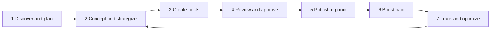
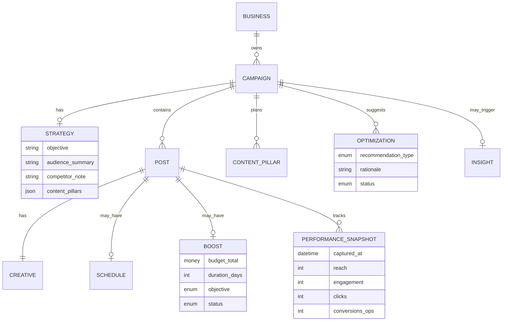
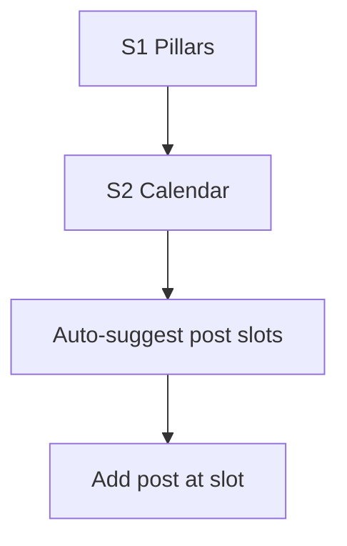
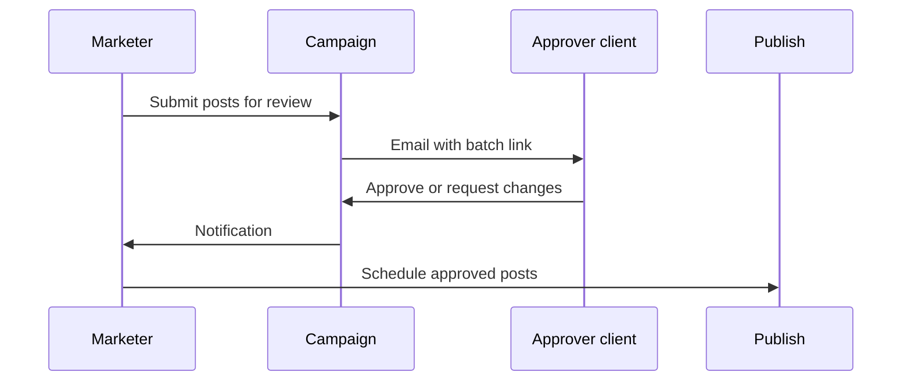
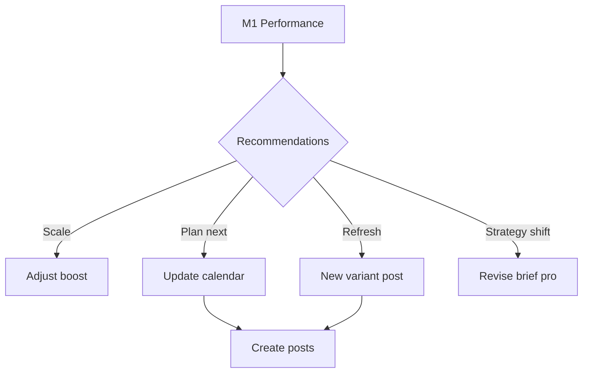

# Grow: Full Marketing Lifecycle — Campaign to Performance

**Version:** 2.0  
**Date:** 2026-08-07  
**Authors:** Mira (flows + screens), Voss (scope + sequencing)  
**Audience:** Product, design, engineering, agency partners  
**Personas:**  
- **Solo owner** — ReFunction Rehab (Dr. Priya): simplified path, same engine underneath  
- **Agency / pro marketer** — Local social agency or in-house marketer running 5–20 clients: full lifecycle exposed  
- **Partner ICP** — Event/community operator (KK Mela): campaign + multi-post + schedule + basic boost

**Related docs:** `studio-mira-flow-specs.md`, `grow-campaign-complete-flow.md` v1 (owner paths), `Context/kk-mela-ventures-260701-095756.md`

---

## 1. Voss strategic frame (updated)

Social agencies sell a **closed loop**: strategy → create → publish → boost → measure → optimize → repeat. KaushalStack must support that loop for Growth to compound, but **not** by cloning Meta Ads Manager or HubSpot.

### 1.1 What we compose (Growth layer)

| Agency capability | KaushalStack expression |
|-------------------|------------------------|
| Discovery & conceptualization | Brief + goals + audience chips + competitor insight (Growth Charter) |
| Content strategy | Campaign object + content pillars + calendar |
| Creative & copy | Suggested post + light edit + variants |
| Client approval | Share link + approver + comment thread |
| Organic publish | Schedule to IG/FB/LI + WA copy |
| Boost / paid | **Guided boost** on published post (budget, duration, objective, local audience) |
| Performance | Platform metrics + **ops outcomes** (bookings, orders, sign-ups on tenant site) |
| Optimize & tweak | Recommendations tied to data; duplicate winning post; pause boost |

### 1.2 What we integrate or defer

| Capability | Approach |
|------------|----------|
| Full ads manager (ad sets, lookalikes, pixel wizard) | **Defer** — deep link to Meta Business Suite when needed |
| Cross-platform paid (Google, X) | **Later** — Meta first (India SMB reality) |
| Revenue attribution / RAS billing | **Avoid** (KK feedback) — show honest metrics, no inflated ROAS promises |
| Community management (DMs, comments inbox) | **v2** — or integrate Meta inbox |
| Influencer / UGC marketplace | **Out of scope** |

### 1.3 Moat (why this beats a generic agency tool)

Agencies get **creative + publish + boost**. KaushalStack adds **ops-linked performance**: "This post drove 4 bookings on your site" because presence, channels, and operations live on one tenant. That is defensible; a Canva + Buffer stack cannot do it without custom glue.

### 1.4 UX modes (same product, two depths)

| Mode | Who | UI |
|------|-----|-----|
| **Simple** | Single owner | Insight → preview → publish; boost as optional "Promote this post"; performance as one card |
| **Pro** | Agency / power user | Full 7-phase lifecycle visible in campaign; calendar, approvals, boost wizard, reports |

Toggle: **Settings → Grow → Pro mode** (or auto-enable for partner/agency tenants).

---

## 2. The seven-phase agency lifecycle



| Phase | Agency term | Owner sees (simple) | Pro sees |
|-------|-------------|---------------------|----------|
| **1** | Discovery, client brief | Skipped (insight card) | Brief wizard [D1] |
| **2** | Strategy, content plan | Auto from insight | Pillars + calendar [S1–S2] |
| **3** | Creative production | Preview + edit [Q2/Q4] | Batch create + variants [CR1] |
| **4** | Client approval | Share link | Approval workflow [A1] |
| **5** | Organic publish | Schedule [Q5] | Calendar + bulk [Cal1] |
| **6** | Boost / paid | "Promote this post" [B1] | Budget, audience, objective [B1–B3] |
| **7** | Reporting, optimization | "How it did" card [M1] | Dashboard + actions [M1–M3] |

---

## 3. Expanded concept model



### 3.1 Lifecycle statuses (campaign-level)

| Status | Phase implied |
|--------|---------------|
| `Planning` | Phases 1–2: brief/strategy not finalized |
| `In production` | Phase 3: drafts in progress |
| `In review` | Phase 4: waiting on approver |
| `Scheduled` | Phase 5: organic queued |
| `Live` | Published organic and/or boost running |
| `Optimizing` | Phase 7: active tweaks |
| `Completed` | End date passed or manually closed |
| `Paused` | Boost or schedules paused |

---

## 4. Information architecture (full)

```
Grow
├── Home [G0]                         insight + active campaign performance
├── Campaigns [C1]
│   └── Campaign command center [C2]  phases 1–7 tabs
│       ├── Overview                  status, KPIs, next best action
│       ├── Plan [S1]                 strategy, pillars, calendar
│       ├── Posts [C2P]               all posts in campaign
│       ├── Boost [B0]                paid summary
│       ├── Performance [M1]            metrics + ops conversions
│       └── Activity                  audit log
├── New campaign
│   ├── Simple [N2]                   3 fields (solo)
│   └── Pro brief [D1]                discovery wizard (agency)
├── Post flow [P1→Q2→Q4→Q5→Q6]
├── Boost wizard [B1→B3]
├── Reports [RPT1]                    export PDF / share link (pro)
├── Calendar [Cal1]
└── Settings
    ├── Brand kit
    ├── Connected channels [S1]
    ├── Ad account [S2]               Meta ads connection
    ├── Approvers [A0]
    └── Pro mode toggle
```

---

## Phase 1 — Discover and plan

### 1.1 Simple path (solo owner)

**Skipped as a form.** Grow Home insight *is* discovery:

- Signal: empty Friday slots, review gap, event in 12 days  
- System infers: objective = more bookings, audience = local, timing = this week  

Owner taps **Preview suggested post** → campaign draft with implicit brief.

### 1.2 Pro path — Discovery brief [D1]

For agencies or owners who want to plan like an agency.

| Step | Screen | Fields |
|------|--------|--------|
| 1 | **D1a Client context** | Business name (prefilled), vertical, location radius (5/10/25 km) |
| 2 | **D1b Objective** | Chips: Awareness · Footfall · Leads · Bookings · Event sign-ups · Sales |
| 3 | **D1c Audience** | Age band chips, interests (optional), "People like my current customers" toggle |
| 4 | **D1d Competitors** | Auto from Growth Charter: 1–3 local competitors + what they posted recently |
| 5 | **D1e Budget intent** | Organic only · Organic + small boost (Rs X/day) · Ask me later |
| 6 | **D1f Summary** | One-page brief PDF preview → **Create campaign** |

**Outputs:** `Campaign` + `Strategy` record attached.

### Acceptance criteria — Phase 1

- [ ] **P1-AC1:** Simple path never shows D1 unless user enables Pro mode or chooses "Plan like a pro."
- [ ] **P1-AC2:** D1 completable in ≤5 minutes with sensible defaults.
- [ ] **P1-AC3:** Competitor bullets sourced from Growth Charter or marked "We'll add this in your first Growth report."

---

## Phase 2 — Concept and strategize

### 2.1 Content pillars [S1]

Agencies define 3–5 themes per campaign (e.g. "Offer," "Social proof," "Education," "Urgency").

| Element | Example (ReFunction) |
|---------|------------------------|
| Pillar 1 | Monsoon knee pain education |
| Pillar 2 | Offer: 20% off assessment |
| Pillar 3 | Patient stories / trust |
| Pillar 4 | Last-minute Friday slot reminders |

**Simple mode:** System suggests 2 pillars automatically; hidden unless user expands **Plan** tab.

### 2.2 Content calendar [S2]

| View | Use |
|------|-----|
| Week / month grid | Drag posts to dates |
| Suggested cadence | "3 posts before event" template |
| Empty slot actions | Click date → Add post |

**Auto-plan (pro):** From brief + pillars, system proposes 4-post calendar → owner approves or edits.



### Acceptance criteria — Phase 2

- [ ] **P2-AC1:** Calendar shows organic posts and boost start/end markers.
- [ ] **P2-AC2:** Auto-plan generates ≤6 posts by default (avoid overwhelm for solo).

---

## Phase 3 — Create posts

*(Builds on v1 paths A/B/C — see sections 5–9 below.)*

### 3.1 Batch creation [CR1] (pro)

| Action | Behavior |
|--------|----------|
| **Generate set from calendar** | One brief → N posts (one per empty slot), each with pillar tag |
| **Variant for A/B** | Duplicate post → "Try different headline" regeneration |
| **Format per channel** | Same concept → IG 4:5, FB 1:1, LI doc (Event kit) |

### 3.2 Creative pipeline (unchanged core)

Brief + brand kit + pillar → copy → image template → crop → **Q2 Preview**.

| Control | Simple | Pro |
|---------|--------|-----|
| Regenerations | 2 free | Unlimited fair use |
| Variants | 1 at a time | Side-by-side compare [CR2] |
| Carousel | Event kit | Event kit + manual slide order v1.2 |

---

## Phase 4 — Review and approve

### 4.1 Approval states (post-level)

| Status | Meaning |
|--------|---------|
| `Draft` | Internal only |
| `Pending review` | Sent to approver |
| `Changes requested` | Comments to address |
| `Approved` | Ready to schedule/publish |
| `Rejected` | Archive or revise |

### 4.2 Flows

**Solo (share link):** Q2 → **Share for review** → helper OK offline → publish.

**Pro (structured):**



| Screen | Purpose |
|--------|---------|
| **A1** Approver inbox (optional login) | List pending posts |
| **PL** Public preview | Mock + caption + approve/reject |
| **C2** | Filter: Needs my action |

**Rule:** Approval optional per campaign; default off for solo.

---

## Phase 5 — Publish (organic)

Same as v1 **Q5** + **Cal1**:

- Publish now / schedule / WA copy only  
- OAuth at publish time  
- Bulk schedule from C2  
- Recurring (Growth tier)

**Agency addition:** **Publish checklist** before queue:

- [ ] Brand kit applied  
- [ ] Approved (if required)  
- [ ] Link URL resolves (tenant booking page)  
- [ ] Boost planned (optional flag)

---

## Phase 6 — Boost (paid promotion)

### 6.1 Philosophy

**Guided boost**, not Ads Manager. Owner promotes **an existing published post** (or scheduled-with-boost) with guardrails.

### 6.2 Entry points

| From | Action |
|------|--------|
| Q6 after publish | **Promote this post** |
| C2 post row | **Boost** |
| M1 performance | **Boost top post** / **Pause underperforming boost** |

### 6.3 Boost wizard [B1 → B3]

| Step | Screen | Fields |
|------|--------|--------|
| 1 | **B1 Objective** | More profile visits · More link clicks · More messages (WA) · More bookings (link to site) |
| 2 | **B2 Audience** | **Local** (radius km, default 5) · **Followers** · **Custom** (pro: age, interests simplified) |
| 3 | **B3 Budget & duration** | Daily budget Rs (min Rs 200) · Total cap · Run 3 / 7 / 14 days · Preview estimated reach band (honest ranges, not guarantees) |
| 4 | **B4 Review** | Summary + payment method (Meta ad account via S2) · **Start boost** |

### 6.4 Ad account connection [S2]

- Connect Meta ad account alongside Page/IG  
- If missing: explain "Boost uses your Meta ad account; you pay Meta directly"  
- KaushalStack does **not** mark up ad spend in v1 (KK: avoid attribution billing complexity)

### 6.5 Boost statuses

| Status | UI |
|--------|-----|
| `Pending` | Meta processing |
| `Active` | Spend + days remaining on C2 |
| `Paused` | Owner paused |
| `Completed` | Budget/time exhausted |
| `Rejected` | Policy error + fix guidance |

### Acceptance criteria — Phase 6

- [ ] **P6-AC1:** Boost only on posts that are published or scheduled with valid creative.
- [ ] **P6-AC2:** Show "You pay Meta" clearly; no hidden KaushalStack ad markup in v1.
- [ ] **P6-AC3:** Simple mode: B1–B3 collapsed to **Promote locally · Rs 500 · 7 days** smart default with "Customize."

---

## Phase 7 — Track performance and optimize

### 7.1 Metrics layers

| Layer | Metrics | Source |
|-------|---------|--------|
| **Platform** | Reach, impressions, likes, comments, shares, link clicks, CTR | Meta/LinkedIn APIs |
| **Boost** | Spend, cost per click, frequency | Meta Marketing API |
| **Ops (KaushalStack)** | Bookings, orders, form submits, event sign-ups | Tenant site + operations |
| **Combined** | Cost per booking (when boost + booking link) | Computed, shown honestly |

**No fake ROAS.** If ops link missing, show platform metrics only + prompt "Add booking link to measure results."

### 7.2 Performance dashboard [M1]

**Campaign command center → Performance tab**

```
Monsoon knee-care, August          Live · Boost active

This week
┌─────────────┬─────────────┬─────────────┬─────────────┐
│ Reach       │ Link clicks │ Bookings    │ Ad spend    │
│ 12,400      │ 186         │ 4           │ Rs 2,340    │
└─────────────┴─────────────┴─────────────┴─────────────┘

Cost per booking: Rs 585 (4 bookings, Rs 2,340 spend)

Posts ranked by bookings
1. Fri offer post · 3 bookings · [View]
2. WA reminder · 1 booking · [View]

Recommendations
· Boost #1 is outperforming; add Rs 300/day for 3 more days [Apply]
· Post #3 low clicks; try new headline [Create variant]
· Friday slots filling; consider pausing boost [Pause]
```

### 7.3 Optimization actions [M2]

| Recommendation type | System action |
|----------------------|---------------|
| **Scale winner** | Increase boost budget (pre-filled B3) |
| **Pause loser** | Pause boost or stop scheduled repeats |
| **Refresh creative** | Duplicate post → regenerate caption/image |
| **Shift timing** | Reschedule next post to day that converted |
| **Add post** | Suggest new pillar post from insight |

Owner taps **Apply** → confirm → executes (boost API or opens Q4).

### 7.4 Reporting [RPT1] (pro / agency)

| Output | Contents |
|--------|----------|
| **Campaign report PDF** | Brief, posts published, boost summary, metrics, ops outcomes |
| **Share link** | Client-facing read-only (7/30 days) |
| **Weekly email** | Auto to owner + approver |

### 7.5 Closed loop back to Phase 2



### Acceptance criteria — Phase 7

- [ ] **P7-AC1:** Ops conversions require UTM or native link to tenant booking/order URL.
- [ ] **P7-AC2:** Recommendations max 3 active per campaign (confident clarity).
- [ ] **P7-AC3:** Simple mode: single performance card on G0 + C2, not full M1 grid.

---

## 5. Three ways to start a campaign (unchanged core)

| Path | When | Campaign created |
|------|------|------------------|
| **A. Insight → suggested** | Default solo | Auto on preview |
| **B. New campaign** | Planned push | N2 or D1 (pro) |
| **C. Quick post** | One-off | Attach later |

*(Detailed steps: same as v1 sections 6–8.)*

---

## 6. Solo owner end-to-end (simple mode, full loop)

**Priya, one campaign, with boost and optimize:**

| Day | Phase | Action |
|-----|-------|--------|
| Wed | 1–3 | G0 insight → Q2 preview → schedule Post 1 |
| Thu | 3 | C2 add Post 2 |
| Fri | 5 | Post 1 publishes |
| Sat | 6 | Q6 **Promote this post** → Rs 500 / 7 days / local |
| Tue | 7 | G0 card: "12k reach, 2 bookings" → **Add Rs 300/day** |
| Thu | 7 | Low-performing Post 3 → **Try another angle** |
| Mon | 7 | Report: 4 bookings, pause boost, mark complete |

**Interaction budget (simple):** Insight to first scheduled post ≤5 taps; boost ≤4 taps with smart defaults.

---

## 7. Agency end-to-end (pro mode)

**Local agency "ReachLocal" managing ReFunction as client:**

| Phase | Actions |
|-------|---------|
| 1 | D1 brief with client: objective bookings, Rs 5k boost budget |
| 2 | S1 pillars + S2 4-week calendar auto-plan |
| 3 | CR1 generate 8 posts → client review |
| 4 | A1 batch approval via PL links |
| 5 | Cal1 schedule all approved |
| 6 | B1–B3 boost on top 2 posts after 48h organic |
| 7 | RPT1 PDF to client + M2 scale/pause recommendations |
| Loop | Revise S2 for September based on M1 |

**Future:** Agency multi-client workspace (one login, many tenants) = **partner tier**, not v1.

---

## 8. Collaboration matrix (solo → agency)

| Capability | Solo | Pro owner | Agency partner |
|------------|------|-----------|----------------|
| Share preview link | ✓ | ✓ | ✓ |
| Approver email | v1.1 | ✓ | ✓ |
| Comment thread | v1.1 | ✓ | ✓ |
| Batch approval | — | ✓ | ✓ |
| Client report PDF | — | ✓ | ✓ |
| Multi-client switcher | — | — | v2 |
| White-label reports | — | — | v2 |

---

## 9. Feature roadmap by phase

| Phase | v1 | v1.1 | v2 |
|-------|-----|------|-----|
| 1 Discover | Insight only | D1 pro brief | Auto-discovery from ops |
| 2 Strategy | Implicit | S1 pillars, Cal1 | Auto-plan + competitor sync |
| 3 Create | Q2/Q4, paths A/B/C | CR1 batch, variants | Video, carousel editor |
| 4 Approve | Share link | A1 workflow | Multi-round revisions |
| 5 Publish | Q5 schedule | Bulk, recurring | LI native, YT Shorts |
| 6 Boost | — | B1–B3 guided boost | Advanced audience, lookalike |
| 7 Track | — | M1 platform metrics | Ops attribution, M2 auto-apply |
| 7 Report | — | RPT1 PDF | Weekly auto + agency multi-tenant |

**v1 ships:** Phases 3–5 (existing hi-fi) + stubs for 6–7.  
**v1.1:** Boost + basic M1 (reach, clicks, spend).  
**v2:** Ops conversions + optimization loop + agency workspace.

---

## 10. Screen index (complete lifecycle)

| ID | Name | Phase |
|----|------|-------|
| G0 | Grow Home | 1, 7 summary |
| D1 | Discovery brief | 1 pro |
| S1 | Content pillars | 2 |
| S2 | Content calendar | 2 |
| N2 | Simple campaign setup | 1 |
| P1/P2 | Post brief / channel | 3 |
| Q2/Q4/Q5/Q6 | Preview / edit / publish / done | 3, 5 |
| CR1/CR2 | Batch create / compare variants | 3 pro |
| A1/PL | Approval / public preview | 4 |
| Cal1 | Calendar | 2, 5 |
| S1/S2 | Social + ad account connect | 5, 6 |
| B1–B4 | Boost wizard | 6 |
| C1/C2 | Campaign list / command center | All |
| M1/M2 | Performance / optimization actions | 7 |
| RPT1 | Report export | 7 pro |

---

## 11. Tier capabilities (Ada to confirm)

| Capability | Free | Growth Rs 3,000/mo | Partner / Agency |
|------------|------|---------------------|------------------|
| Organic publish | 1/mo | Unlimited | Per client |
| Schedule + calendar | — | ✓ | ✓ |
| Pro mode / D1 brief | — | ✓ | ✓ |
| Boost wizard | — | ✓ (own Meta bill) | ✓ |
| Performance M1 | — | Platform metrics | + ops metrics |
| Optimization recs | — | Manual apply | Auto-apply v2 |
| Client PDF reports | — | ✓ | White-label v2 |
| Multi-client | — | — | ✓ v2 |

---

## 12. Out of scope (still not KaushalStack)

| Item | Why |
|------|-----|
| Full Meta Ads Manager replacement | Commodity; integrate don't clone |
| Google Ads / YouTube ads | Sequenced after Meta boost works |
| RAS-style guaranteed ROAS | Trust (Voss #1, KK feedback) |
| Social listening at scale | Not ops-composable |
| Influencer marketplace | Not bounded business system |
| Billing client for ad markup | Avoid; client pays Meta directly v1 |

---

## 13. Implementation sequence (updated)

1. **v1 (now):** Campaign entity, paths A/B/C, C2 command center shell, approval share link  
2. **v1.1:** Cal1, S1 pillars lite, A1 approval, **B1–B3 boost**, **M1 platform metrics**  
3. **v1.2:** Ops conversion on booking links, M2 recommendations (manual apply)  
4. **v2:** D1 pro brief, CR1 batch, RPT1, agency multi-tenant, auto-optimize  

---

## 14. Open decisions

1. Boost in v1.1 vs v2 given Meta app review timeline?  
2. Minimum boost budget UX (Rs 200/day default)?  
3. Show competitor content in D1 from scraping vs Growth Charter only?  
4. Agency workspace: separate product SKU or partner login on same portal?

---

*End of document — full marketing lifecycle v2.0*
