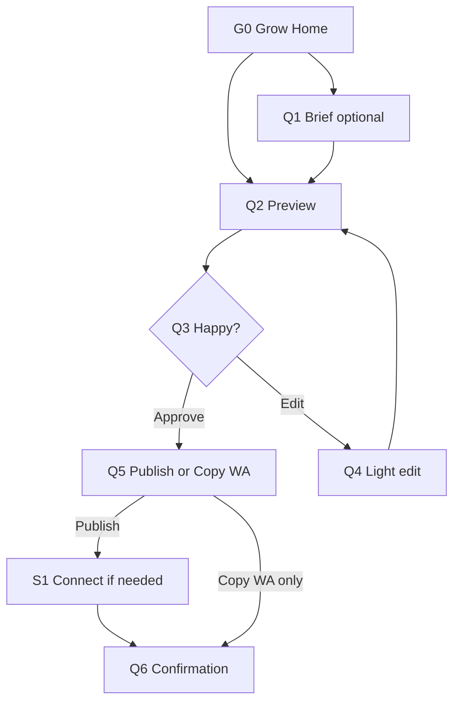
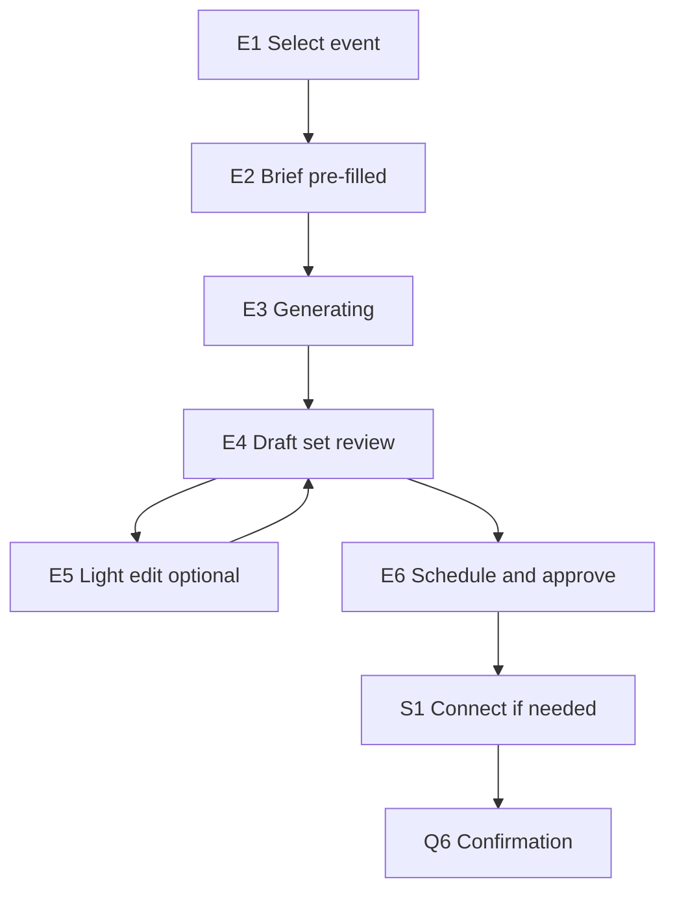

# KaushalStack Grow / Studio — Mira Flow Specs

**Version:** 1.0  
**Date:** 2026-08-07  
**Owner:** Mira (Product Design)  
**Status:** Ready for Lux review → engineering  
**Scope:** Channels + Growth layer only — social/campaign artifacts, scheduling, WhatsApp copy. Not assessments, not B2B RFQ, not full Canva replacement.

---

## 1. Problem statement

The prior Studio UI treated **multi-channel campaign creation** as the whole product. Real KaushalStack users need:

- **Outcome first** — “fill empty Friday slots,” “promote next workshop,” not “create campaign.”
- **Value before OAuth** — preview with their offer before connecting Meta/LinkedIn.
- **Light edit, not rebuild** — approve draft, tweak caption/crop; optional deep edit.
- **WhatsApp co-equal** — copy-to-send is often the primary action in India SMB.
- **Nest under Grow** — Studio is a module, not a standalone app.

---

## 2. Design principles (non-negotiable)

| # | Principle | Implication |
|---|-----------|-------------|
| P1 | **Insight → action** | Every post starts from a *reason* (empty slots, competitor gap, event date). |
| P2 | **Preview before connect** | Channel OAuth only when user taps Publish/Schedule. |
| P3 | **One job per flow** | Quick post ≠ Event kit; don’t force four channels. |
| P4 | **Agents invisible** | UI says “Suggested post,” not “Tara generated.” |
| P5 | **Mobile-capable** | Owner can complete Quick post on phone in ≤4 taps after landing on preview. |
| P6 | **Light-first** | Default theme light; dark optional (Lux). |
| P7 | **Honest tier gates** | Free: generate + copy; Growth: schedule + recurring + insights on home. |

---

## 3. Information architecture

Studio lives inside **Owner Portal → Grow**, not top-level “Studio app.”

```
Owner Portal
├── Home (business pulse — optional v1.1)
├── Site          (presence)
├── Grow          ← primary nav for this spec
│   ├── Grow Home           [G0]
│   ├── New post            [Q1–Q5]  Quick post flow
│   ├── Event kit           [E1–E6]  Event kit flow
│   └── Campaigns list      [C1]     history
├── Operations    (orders, bookings — out of scope)
└── Settings
    ├── Brand kit
    └── Connected channels  [S1]
```

**Entry points into Grow flows:**

| Entry | Lands on |
|-------|----------|
| Grow Home → “Use suggestion” | Q2 Preview (pre-filled) |
| Grow Home → “New post” | Q1 Brief |
| Grow Home → “Promote event” | E1 Event picker |
| Event record → “Promote” | E2 Brief (pre-filled) |
| Assessment program → “Promote workshop” (Rachana) | E2 Brief (pre-filled) |
| Campaigns list → row tap | C2 Detail or Q3/Q4 if draft |

---

## 4. Personas & default flows

| Persona | Primary flow | Default channel | Notes |
|---------|--------------|-----------------|-------|
| ReFunction Rehab (B2C service) | **Quick post** | Instagram or WA copy | Home insight: empty Fri slots |
| Kirana / sari (D2C local) | **Quick post** | Facebook Marketplace + WA | Insight: local review gap |
| Event / community operator | **Event kit** | IG + FB + LI | KK ICP; monthly subscription |
| Coach / L&D (Rachana) | **Event kit** from program | LinkedIn + email copy | Assessments remain separate product surface |
| Enroll Engineer | *Not Studio-first* | — | Link from marketing only if needed |

---

## 5. Flow diagrams

### 5.1 Quick post (primary — 80% usage)



**Interaction budget:** Grow Home → scheduled or WA copied in **≤5 user actions** (excluding OAuth).

### 5.2 Event kit (secondary — event ICP)



---

## 6. Screen specifications

Each screen: **Purpose · Layout · Actions · States · Acceptance criteria**

---

### [G0] Grow Home

**Purpose:** Surface *why* to post now; route to Quick post or Event kit.

**Layout (desktop):**
- Page title: **Grow**
- **Insight card** (primary, full width): headline + 1–2 data bullets + primary CTA “Preview suggested post”
- **Quick actions** row: `New post` · `Promote event` · `View campaigns`
- **Optional secondary:** link to Growth report (Growth tier)

**Layout (mobile):** Insight card stacked; quick actions as full-width buttons.

**Primary CTA:** Preview suggested post → Q2 (brief + channel pre-selected from insight).

**States:**

| State | Behavior |
|-------|----------|
| Default | One insight card minimum (rule-based or Growth Charter) |
| No insight data | Generic card: “Tell us what you want to promote” → Q1 |
| Loading insight | Skeleton card, 1–3s max perceived |
| Growth tier locked | Insight visible; “Schedule recurring” shows upgrade pill |

**Acceptance criteria:**

- [ ] **G0-AC1:** Given a tenant with booking/signal data, when Grow Home loads, then an insight card shows a *specific* reason (not generic “grow your business”).
- [ ] **G0-AC2:** Given user taps “Preview suggested post,” then Q2 opens with caption + image + channel pre-filled within 3s (or loading state then content).
- [ ] **G0-AC3:** Given mobile viewport 375px, then all CTAs are ≥44px touch height and no horizontal scroll.
- [ ] **G0-AC4:** Given free tier, then user can reach Q2 preview without payment wall; schedule button shows upgrade on Q5.

---

### [Q1] Quick post — Brief (optional)

**Purpose:** Capture intent when user skips insight or starts “New post.”

**Fields:**
- **What are you promoting?** — single textarea, plain language (not “campaign brief”)
- **Goal** — chips: More bookings · More footfall · Announce offer · Other
- **Channel** — single select default: Instagram · Facebook · WhatsApp copy only
- **Tone** — optional chips: Warm · Professional · Urgent

**Hidden:** Agent names, multi-channel toggles, JSON/spec upload.

**Primary CTA:** See preview → Q2  
**Secondary:** Cancel → G0

**Acceptance criteria:**

- [ ] **Q1-AC1:** Given empty textarea, when user taps See preview, then inline validation prompts for one sentence minimum.
- [ ] **Q1-AC2:** Given user selects WhatsApp copy only, then Q2 shows text-first preview (no image required).
- [ ] **Q1-AC3:** Given user arrived from G0 insight, then Q1 fields are pre-filled and user can skip directly to Q2 in one tap (“Continue”).

---

### [Q2] Preview — Suggested post

**Purpose:** Aha moment — show *their* post before any OAuth.

**Layout:**
- **Left / top:** Post mock (channel-accurate frame: IG 4:5 or FB 1:1)
- **Right / bottom:** “Why this post” panel — 2–3 bullets from insight (e.g. Fri slots, competitor reviews)
- **WhatsApp block:** Always visible below or tab — message text + Copy button
- **Actions:** `Looks good — publish` · `Edit caption or crop` · `Try another angle` (regenerate once)

**States:**

| State | Behavior |
|-------|----------|
| Generating | Skeleton mock + “Preparing your post…” |
| Ready | Full preview |
| Regenerate limit | Free: 2/session; then “Upgrade for more variants” |
| Error | Retry + “Download template text” fallback |

**Acceptance criteria:**

- [ ] **Q2-AC1:** Given generation completes, then preview shows tenant brand name/logo from brand kit (not KaushalStack watermark).
- [ ] **Q2-AC2:** Given any channel preview, then caption is editable in Q4 but readable in full on Q2 (truncate with “more” on mobile).
- [ ] **Q2-AC3:** Given user has not connected channels, when on Q2, then no OAuth prompt appears.
- [ ] **Q2-AC4:** Given WhatsApp block, when Copy tapped, then toast “Copied” and text matches character limits (~1000 chars soft warn).

---

### [Q4] Light edit

**Purpose:** Minimum viable edit — not Canva clone.

**Controls:**
- Caption textarea (with character hint per channel)
- **Change image:** upload · pick from library · “Suggest 3 images” (Growth)
- **Crop / format:** 1:1 · 4:5 · 9:16 with **focal point** drag (required for Rachana P0)
- **Platform variant:** toggle to see LinkedIn/FB caption rewrite (read-only diff, apply one tap)

**Out of scope v1:** Video gen, carousel multi-slide editor (Event kit only), font designer.

**Primary CTA:** Save → Q2  
**Secondary:** Open full Studio (power user) → legacy Card Studio if retained

**Acceptance criteria:**

- [ ] **Q4-AC1:** Given user changes format 1:1 → 4:5, then image re-crops using focal point without cutting branded footer.
- [ ] **Q4-AC2:** Given upload >10MB, then reject with clear max size message before upload completes.
- [ ] **Q4-AC3:** Given carousel Event kit draft opened here, then UI shows slide 1–n switcher (Event kit only).

---

### [Q5] Publish or copy

**Purpose:** Commit action with minimal friction.

**Layout:**
- Channel summary (one channel for Quick post)
- **Publish now** · **Schedule** (Growth tier) · **Copy WhatsApp only**
- Schedule: date + time picker; Growth: “Repeat weekly” toggle
- If channel not connected → inline banner “Connect Instagram to publish” (not blocking WA copy)

**Tier gates:**

| Action | Free | Growth |
|--------|------|--------|
| Copy WA | Yes | Yes |
| Download PNG | Yes | Yes |
| Publish now | 1/month | Unlimited |
| Schedule | No | Yes |
| Recurring | No | Yes |

**Acceptance criteria:**

- [ ] **Q5-AC1:** Given disconnected IG, when Publish tapped, then route to S1 with return URL back to Q5.
- [ ] **Q5-AC2:** Given free tier exceeded publish quota, then show upgrade modal with WA copy still available.
- [ ] **Q5-AC3:** Given Schedule with past datetime, then block with validation message.

---

### [S1] Connect channel (modal or page)

**Purpose:** OAuth only when needed; Meta Page + IG in one flow.

**Content:**
- Explain permissions in one sentence
- Meta: Page picker + linked IG account display
- LinkedIn: company page picker
- Success → return to prior screen with connected badge

**Acceptance criteria:**

- [ ] **S1-AC1:** Given OAuth success, then user returns to Q5 without losing draft state.
- [ ] **S1-AC2:** Given OAuth failure, then show actionable error (permissions denied, no IG business account) with help link.
- [ ] **S1-AC3:** Given Meta connect, then both FB Page and IG Business shown as connected in Settings.

---

### [Q6] Confirmation

**Purpose:** Close loop — trust that something happened.

**Content:**
- Success icon + plain language: “Scheduled for Fri 9 Aug, 10:00 AM on Instagram”
- WA: “Message copied — paste in your broadcast list”
- **View campaign** → C2 · **Create another** → G0

**Failure path:** If publish API fails → show retry + “Saved as draft” + support id; never silent fail.

**Acceptance criteria:**

- [ ] **Q6-AC1:** Given scheduled publish, then Campaigns list shows status Scheduled within 30s.
- [ ] **Q6-AC2:** Given publish API error, then user sees Failed status with Retry on C2.

---

### [E1] Event kit — Select event

**Purpose:** Anchor campaign to an event/program (not orphan campaigns).

**Layout:**
- List: upcoming events (title, date, status)
- `Create new event` — minimal: title, date, location optional
- Empty: “No events yet — create one to promote”

**Acceptance criteria:**

- [ ] **E1-AC1:** Given Rachana assessment program with date, then event appears with type badge “Workshop.”
- [ ] **E1-AC2:** Given user selects event, then E2 brief includes event title + date in read-only chips.

---

### [E2] Event kit — Brief

**Purpose:** Pre-filled brief; user confirms or edits.

**Fields (pre-filled from event):**
- Event name, date/time, audience, CTA (register link / WhatsApp)
- Optional: approver email (B2B)

**Primary CTA:** Generate event kit → E3

**Acceptance criteria:**

- [ ] **E2-AC1:** Given approver email set, then E6 requires approval send before schedule (B2B optional v1.1).

---

### [E3] Generating

**Purpose:** Set expectation for multi-artifact generation.

**UI:** Progress steps — Landing snippet · Instagram · Facebook · LinkedIn · WhatsApp (not necessarily sequential API, but shown as checklist animating)

**Acceptance criteria:**

- [ ] **E3-AC1:** Given generation >30s, then show partial results as each completes (progressive reveal).
- [ ] **E3-AC2:** Given failure on one artifact, then others still usable; failed card shows Regenerate.

---

### [E4] Draft set review

**Purpose:** KK demo parity — one brief → multiple artifacts in one grid.

**Layout:** 2×2 grid (desktop) / vertical stack (mobile)
- Each card: platform icon, format label, thumbnail, `Open` · `Regenerate`
- Sticky footer: `Schedule all` · `Download pack`

**Acceptance criteria:**

- [ ] **E4-AC1:** Given four artifacts generated, then user can schedule all without opening each in editor.
- [ ] **E4-AC2:** Given IG carousel, then thumbnail shows slide count badge “3 slides.”

---

### [E6] Schedule & approve

**Purpose:** Per-platform times + optional approver.

**Layout:** Same as Q5 but multi-row (IG, FB, LI) with checkboxes; WA copy separate; recurring toggle (Growth).

**Acceptance criteria:**

- [ ] **E6-AC1:** Given “Schedule all,” then stagger defaults (+5 min between platforms) editable.
- [ ] **E6-AC2:** Given approver email, then approver receives view-only link (v1.1 — stub OK with email notification spec).

---

### [C1] Campaigns list

**Purpose:** History and status — not landing page.

**Columns/cards:** Name · Status (Draft / Scheduled / Published / Failed) · Channel(s) · Next action date  
**Filters:** All · Draft · Scheduled · Published · Failed

**Acceptance criteria:**

- [ ] **C1-AC1:** Given Failed campaign, then row shows Retry and error hint (token expired vs content policy).
- [ ] **C1-AC2:** Given >20 campaigns, then paginate or infinite scroll with search by name.

---

### [C2] Campaign detail

**Purpose:** Audit trail for one campaign.

**Sections:** Preview(s) · Schedule · Status log · Actions: Duplicate · Cancel schedule · Retry

**Acceptance criteria:**

- [ ] **C2-AC1:** Given Published, then show published timestamp and link to live post if API returns permalink.

---

## 7. Shared components (spec summary)

| Component | States | Notes |
|-----------|--------|-------|
| **Insight card** | default, loading, empty, upgrade | Data from Growth Charter / tenant signals |
| **Post preview frame** | IG 4:5, FB 1:1, LI doc | Channel-accurate chrome, not generic card |
| **WA copy block** | default, copied | Monospace optional; always one tap copy |
| **Focal cropper** | 1:1, 4:5, 9:16 | Drag focal point; no chopped footer text |
| **Connect banner** | disconnected, expired | Inline on Q5/E6, not global gate |
| **Tier upgrade pill** | — | Schedule, recurring, insight depth |

**Touch targets:** 44×44px minimum on mobile (Mira a11y).

**Tier visual:** Free uses muted CTA for Schedule; Growth uses primary accent (coordinate tokens with Lux).

---

## 8. Copy & labeling (placeholders for Suki)

| Avoid | Use |
|-------|-----|
| Campaign Studio | **Grow** or **Posts** |
| Tara / agents | **Suggested post** |
| Generate draft set | **See preview** |
| Card Studio | **Edit post** |
| Connect Facebook (first screen) | **Connect when you publish** |

---

## 9. Out of scope (v1)

- X/Twitter publish  
- AI video generation  
- Full carousel editor in Quick post (Event kit carousel view-only v1)  
- ROAS / attribution dashboards  
- Assessment stages (Rachana — separate spec)  
- Lead scoring (Enroll — separate spec)  
- OAuth before first preview  

---

## 10. Success metrics (for Ada validation)

| Metric | Target | Flow |
|--------|--------|------|
| Time to preview | ≤90s p95 | G0/Q1 → Q2 |
| Actions to schedule | ≤5 median | Quick post |
| Connect conversion | ≥60% of those who tap Publish | S1 |
| WA copy usage | ≥40% of Quick post sessions | Q5/Q6 |
| Week-2 return | ≥30% post once | G0 insight |

---

## 11. Engineering handoff checklist

- [ ] Lux visual pass on G0, Q2, Q4 (light-first)  
- [ ] Suki copy pass on labels in §8  
- [ ] Atlas confirm: draft persistence, OAuth return URLs, campaign entity model  
- [ ] Ada confirm tier gates in §Q5 match pricing doc  
- [ ] Implement Quick post before Event kit (sequencing)  

---

## 12. Open questions

1. **Home pulse:** Is G0 on main Owner Portal home or only under Grow nav for v1?  
2. **Approval v1.1:** Email approver required for Rachana B2B in first release?  
3. **Carousel edit:** Ship view-only carousel in Event kit v1 or block carousel until v1.1?  
4. **Legacy Vajrahasta Card Studio:** Deprecate or hide behind “Advanced edit”?  

---

*End of spec — Mira v1.0*
